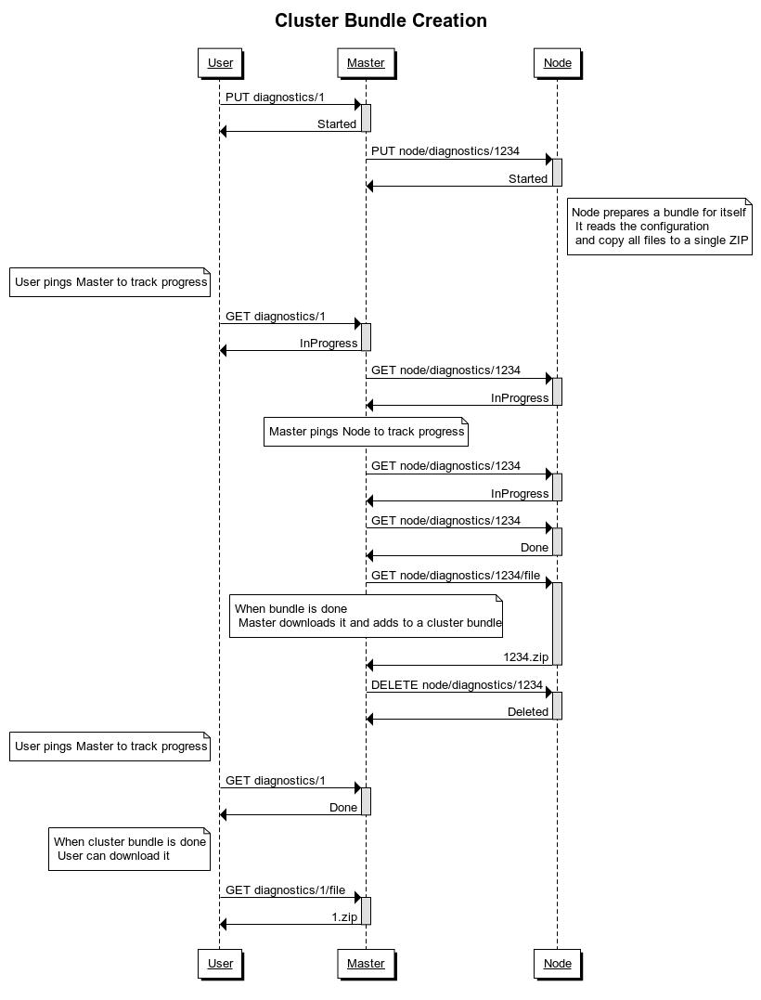

# dcos-diagnostics [](https://opensource.org/licenses/Apache-2.0) [](https://jenkins.mesosphere.com/service/jenkins/job/public-dcos-cluster-ops/job/dcos-diagnostics/job/dcos-diagnostics-master/) [](https://goreportcard.com/report/github.com/dcos/dcos-diagnostics)

dcos-diagnostics is a monitoring agent which exposes a HTTP API for querying from the `/system/health/v1` DC/OS API.
dcos-diagnostics puller collects the data from agents and represents individual node health for things like
system resources as well as DC/OS-specific services.

dcos-diagnostics generate historical mesos-states bundles.
For more context see: https://github.com/dcos/dcos/pull/5907.

### Architecture

Originally dcos-diagnostics was designed in Master/Agent model. It's running on every DC/OS node.

* Master

Master runs on DC/OS Masters. There is the point of entry to dcos-diagnostics from remote systems (e.g., UI).
Master is able to query other nodes for health status. Master is responsible for generating cluster diagnostics bundle.

* Public Agent and Agent

Agent runs on every non Master node (excluding bootstrap node). The main responsibility of Agent is providing JSON
report of DC/OS Systemd components health. Agent also provides logs that should appear in cluster bundle.


### Diagnostics Bundle

Diagnostics bundle is just a ZIP file with all files useful when debugging problems.
It can be treated as flight recorder (blackbox) but for clusters. List of interesting files, commands and endpoints,
that should be fetch in bundle is configurable and deployed with dcos-diagnostics binary.
Diagnostic bundle generation process fetches all configured files and stores them in single ZIP.
ZIP contains directories named after nodes' IP and role
(see: [api/rest/coordinator.go](https://github.com/dcos/dcos-diagnostics/blob/f719ffce0339f07f1be4a1ca24fb8b96fe94dff4/api/rest/coordinator.go#L361-L363)).

The contents of the generated bundle are not stable over time and any internal or third party bundle analysis tooling
should be programmed very defensively in this regard.
See: [dcos-docs-site#2253](https://github.com/mesosphere/dcos-docs-site/pull/2253)

#### API

API documentation could be find in [docs](/docs) directory. It's using
[OpenApi v3.0](https://github.com/OAI/OpenAPI-Specification/blob/master/versions/3.0.0.md)
You can see rendered version
[here](https://temando.github.io/open-api-renderer/demo/?url=https://raw.githubusercontent.com/dcos/dcos-diagnostics/master/docs/api.yaml).
There are two versions of bundle API.

1. Old serial API – single master calls every node for data. This API is deprecated and should be removed in DC/OS 2.2


2. New parallel API – single master schedules local bundle creation for every node in a cluster. Then master wait until
nodes finishes bundles. Master downloads finished bundles and merge them into a single cluster bundle zip.



Old API is faster for smaller clusters but it's slow for large cluster, so we recomend using only new API that's available
since DC/OS 2.0.

To get more information read [the design doc](https://docs.google.com/document/d/1UU47_ZVBPQRzzSc9D57W4h7VtzRyMxiLTcZ4XKfwA5I/edit?usp=sharing)

### History

In the past dcos-diagnostics was bundled with:

* [dcos-checks](https://github.com/dcos/dcos-checks)
* [dcos-checks-runner](https://github.com/dcos/dcos-check-runner)

– see: https://github.com/dcos/dcos-diagnostics/pull/35
In that time dcos-diagnostics was called `3dt`
([DC/OS Distributed Diagnostics Tool](https://github.com/dcos/3dt/tree/master)).
It was deprecated in Jun, 2017 but some references might still exists.


## Build

```
go get github.com/dcos/dcos-diagnostics
cd $GOPATH/src/github.com/dcos/dcos-diagnostics
make
build/dcos-diagnostics --version
```

## Run
Run dcos-diagnostics once, on a DC/OS host to check systemd units:

```
dcos-diagnostics --diag
```

Get verbose log output:

```
dcos-diagnostics --diag --verbose
```

Run the dcos-diagnostics aggregation service to query all cluster hosts for health state:

```
dcos-diagnostics daemon --pull
```

Start the dcos-diagnostics health API endpoint:

```
dcos-diagnostics daemon
```

### dcos-diagnostics daemon options

| Flag                          |   Type  | Description                                                                                               |
|-------------------------------|:-------:|-----------------------------------------------------------------------------------------------------------|
| agent-port                    |   int   | Use TCP port to connect to agents. (default 1050)                                                         |
| ca-cert                       |  string | Use certificate authority.                                                                                |
| command-exec-timeout          |   int   | Set command executing timeout (default 50)                                                                |
| debug                         |   bool  | Enable pprof debugging endpoints.                                                                         |
| diagnostics-bundle-dir        |  string | Set a path to store diagnostic bundles (default "/var/run/dcos/dcos-diagnostics/diagnostic_bundles")      |
| diagnostics-job-timeout       |   int   | Set a global diagnostics job timeout (default 720)                                                        |
| diagnostics-units-since       |  string | Collect systemd units logs since (default "24h")                                                          |
| diagnostics-url-timeout       |   int   | Set a local timeout for every single GET request to a log endpoint (default 1)                            |
| endpoint-config               | strings | Use endpoints_config.json (default [/opt/mesosphere/etc/endpoints_config.json])                           |
| exhibitor-url                 |  string | Use Exhibitor URL to discover master nodes. (default "http://127.0.0.1:8181/exhibitor/v1/cluster/status") |
| fetchers-count                |   int   | Set a number of concurrent fetchers gathering nodes logs (default 1)                                      |
| force-tls                     |   bool  | Use HTTPS to do all requests.                                                                             |
| health-update-interval        |   int   | Set update health interval in seconds. (default 60)                                                       |
| hostname                      |  string | A host name (by default it uses system hostname) (default "orion")                                        |
| iam-config                    |  string | A path to identity and access management config                                                           |
| ip-discovery-command-location |  string | A command used to get local IP address                                                                    |
| master-port                   |   int   | Use TCP port to connect to masters. (default 1050)                                                        |
| no-unix-socket                |   bool  | Disable use unix socket provided by systemd activation.                                                   |
| port                          |   int   | Web server TCP port. (default 1050)                                                                       |
| pull                          |   bool  | Try to pull runner from DC/OS hosts.                                                                      |
| pull-interval                 |   int   | Set pull interval in seconds. (default 60)                                                                |
| pull-timeout                  |   int   | Set pull timeout. (default 3)                                                                             |

## Test
```
make test
```

## Future

Starting with DC/OS 2.0 we deprecated "old" bundle API and proposed new parallel API. The deprecation process should
be finished with DC/OS 2.3 and all code responsible for old API can be deleted. In order to do this we need to change
all scripts in other DC/OS components to use new DC/OS Diagnostics CLI.

New Diagnostics Bundle API gives us opportunity to create diagnostics bundle on a single node even if DC/OS Cluster is down.
Next step should be making dcos-diagnostics independent from DC/OS. Currently, Cluster bundle will not be generated if
Mesos, Admin Router or DNS is down. To do it we should move from single service to binary deployed on cluster.
This idea is described in [design doc](https://docs.google.com/document/d/1Z6dcOK1_IQFlHGiQ_y1jsZ4RTo0IVpkRrKPGzniHC4E/edit?usp=sharing)

We keep user stories in [this doc](https://docs.google.com/document/d/1tuzwye3EvraGw15bqE7yI9PZ_QYwX3x_eNi3xmFP554/edit?usp=sharing)
Tasks are gathered under [DCOS-57837](https://jira.mesosphere.com/browse/DCOS-57837).